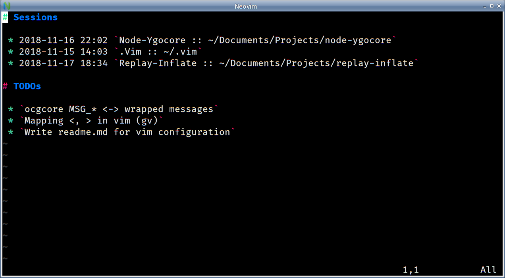
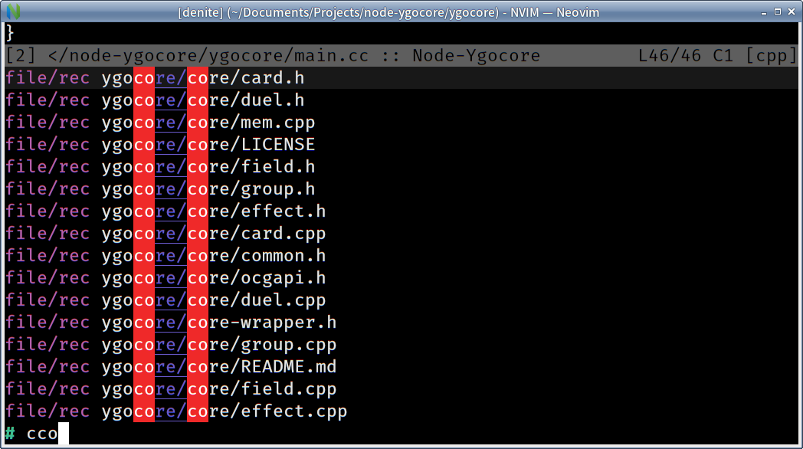
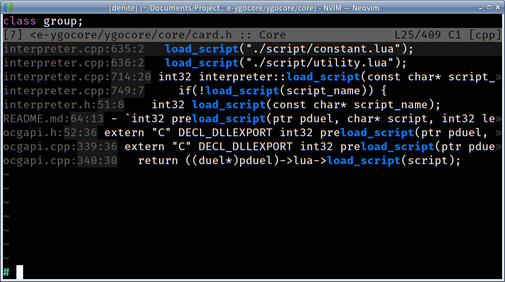
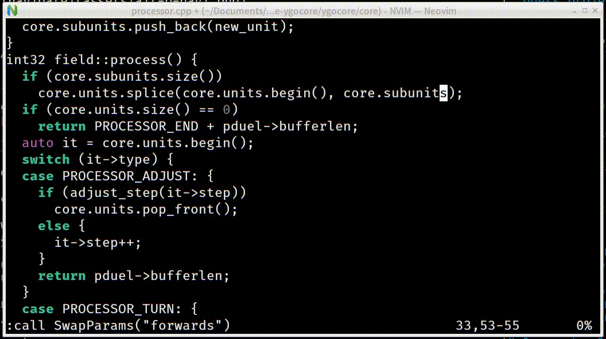
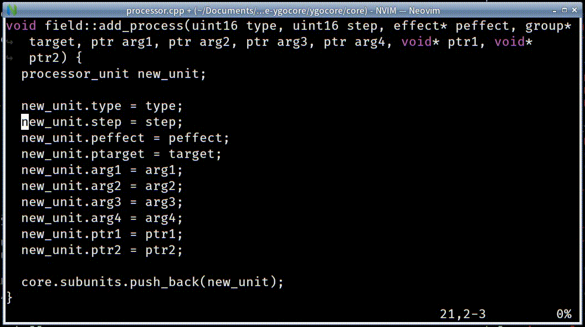
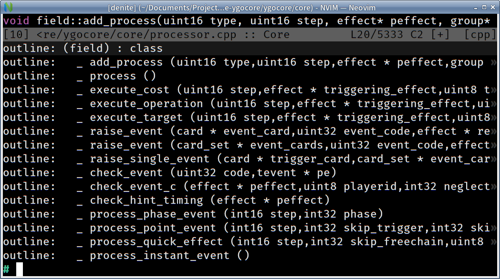
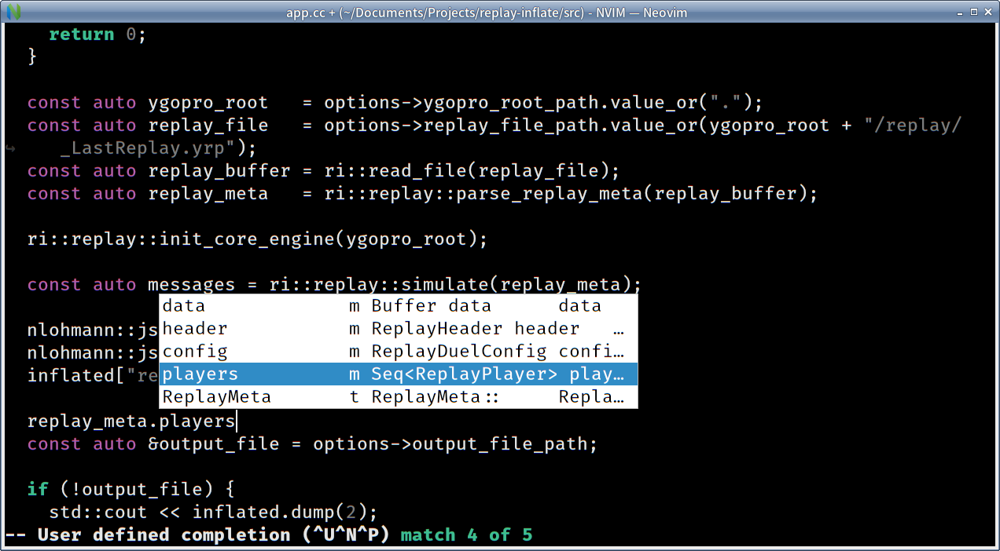
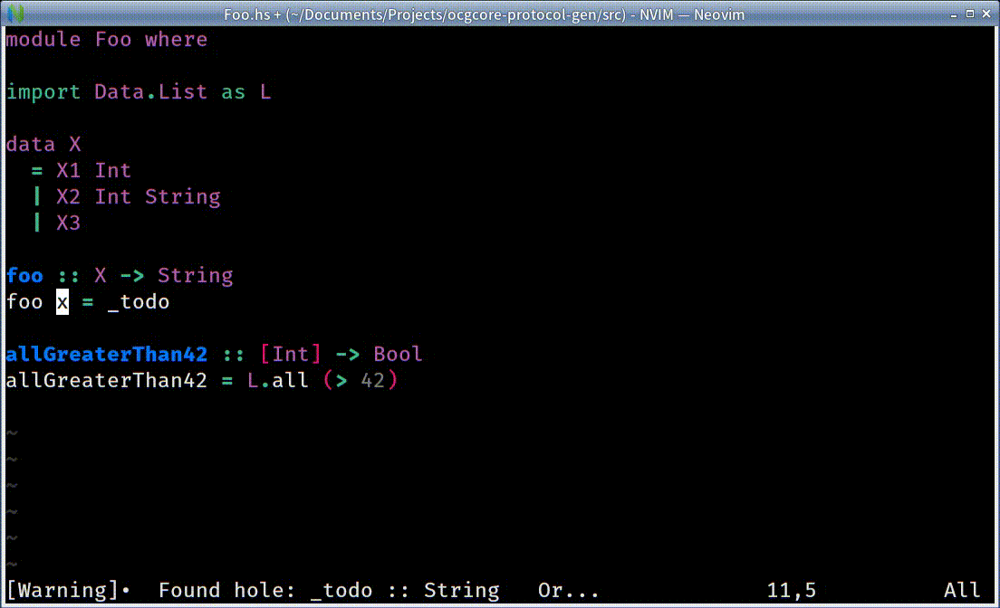

# My Persional NVIM/VIM configuration

My persional nvim/vim configuration for_(mostly)_ writing c++ & haskell.

# Install <small>_(not always works)_</small>

Clone this repo to

 - `~/.config/nvim` if you're using neovim, or

 - `~/.vim` if you prefer classic vim.

Then launch [n]vim and execute `:PlugInstall`

Some external programs are required by some plugins:

 - [git](https://git-scm.com/): to install plugins.

 - [task - the command-line todo list manager](https://taskwarrior.org/): required by the startup buffer.

 - [Haskell ide engine](https://github.com/haskell/haskell-ide-engine): for haskell language support

 - libclang: for clang\_complete

# Features

## editor interface

Keep the editor interface simple:

  - no line numbers
  - no status bar (`set laststatus = 0`)
  - a startup buffer displays sessions & TODOs
    

    > press `Enter` under a session to load it.
    >
    > or press `Backspace` to delete it.
    >
    > use `:MkSession` to save or update session.

## Keybindings with <kbd>Alt</kbd> key

  - <kbd>Alt-w</kbd> to close buffer.

  - <kbd>Alt-q</kbd> to close last buffer.

  - <kbd>Alt-s</kbd> to save the file.

  - <kbd>Alt-p</kbd> to navigate buffers/files (with [`denite`](https://github.com/Shougo/denite.nvim) and [`vim-projectroot`](https://github.com/dbakker/vim-projectroot) plugin):
    

    > fuzzy match!

  - <kbd>Alt-Shift-f</kbd> to search text in project
    

## Plugins

Plugins are managed using [vim-plug](https://github.com/junegunn/vim-plug)

 - localvimrc

   Load `.lvimrc` automatically.

   > [`Plug 'embear/vim-localvimrc'`](https://github.com/embear/vim-localvimrc)

 - arguments text object

   

   > [`Plug 'sgur/vim-textobj-parameter'`](https://github.com/sgur/vim-textobj-parameter)
   >
   > [`Plug 'vim-scripts/swap-parameters'`](https://github.com/vim-scripts/swap-parameters)

 - easy align

   

   > [`Plug 'junegunn/vim-easy-align'`](https://github.com/junegunn/vim-easy-align)

 - ultisnips

   Snippets support.

   > [`Plug 'SirVer/UltiSnips'`](https://github.com/SirVer/ultisnips)

 - junkfile

   Create temporary file.

   > [`Plug 'Shougo/junkfile.vim'`](https://github.com/Shougo/junkfile.vim)

 - outline

   

   > [`Plug 'Shougo/unite-outline'`](https://github.com/Shougo/unite-outline)

## c/cpp language support

Semantic code completion/jump via clang\_complete.

> YouCompleteMe is too complicated, clang\_complete is just what I need.

## haskell language support

Haskell language support provided by [haskell ide engine](https://github.com/haskell/haskell-ide-engine).

Features:

  - code completion
  - jump to definition
  - hover document
  - split case
  - ...

  
